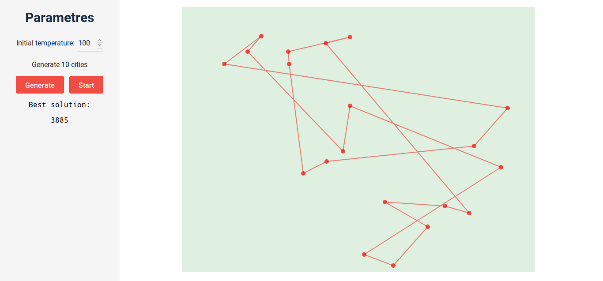
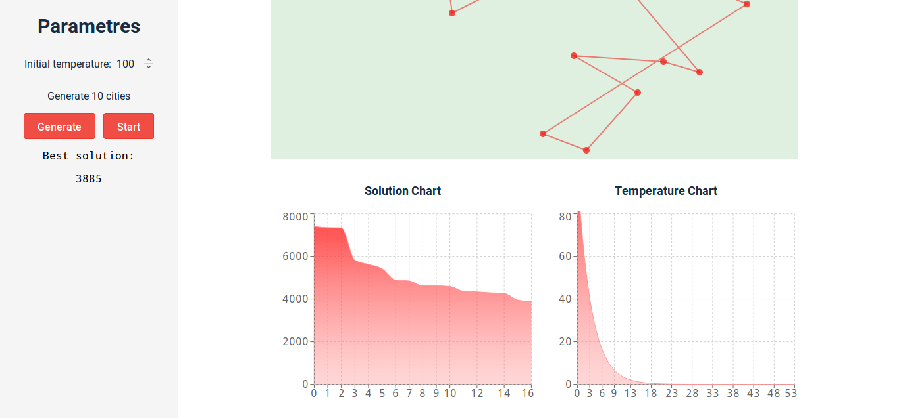

### Implementation of the [Simulated Annealing Method](https://en.wikipedia.org/wiki/Simulated_annealing) to the TSP in React.js.

* git clone https://github.com/FoxMalder/Travel-salesman-problem.git && cd Travel-salesman-problem
* npm i
* npm start